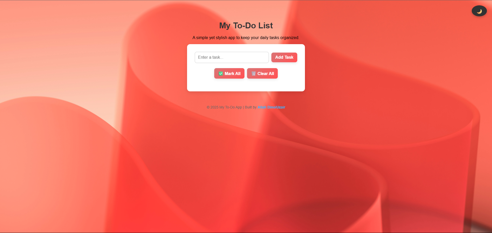
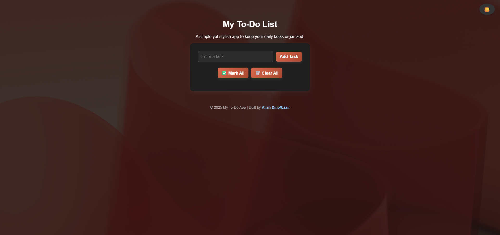

📝 Simple To-Do App

A clean, modern and responsive to-do list web app to help you stay organized and productive. Built using HTML, CSS, and JavaScript, this app lets you manage your tasks efficiently with a sleek UI and persistent local storage.

🔍 Features

- ✅ Add and delete tasks
- 🔄 Mark tasks as complete/incomplete
- 🌙 Toggle between dark and light mode
- 💾 Saves your tasks in local storage
- 🧹 Bulk actions: Mark all & Clear all tasks

📸 Preview


 

🚀 Getting Started

To run the project locally:
1. Clone the repository:
   ```bash
   git clone https://github.com/uzairsolangi/todo-app.git  
2. Open index.html in your browser.

🛠️ Built With

HTML5
CSS3
JavaScript

📂 Project Structure
todo-app/
├── index.html
├── script.js
├── style.css
└── assets/
    ├── background.jpg
    ├── dark-mode.png
    ├── light-mode.png

🙋‍♂️ Author
Allah Dino/Uzair
📎[GitHub Profile](https://github.com/uzairsolangi)

📃 License
This project is open source and available under the [MIT License](LICENSE).
